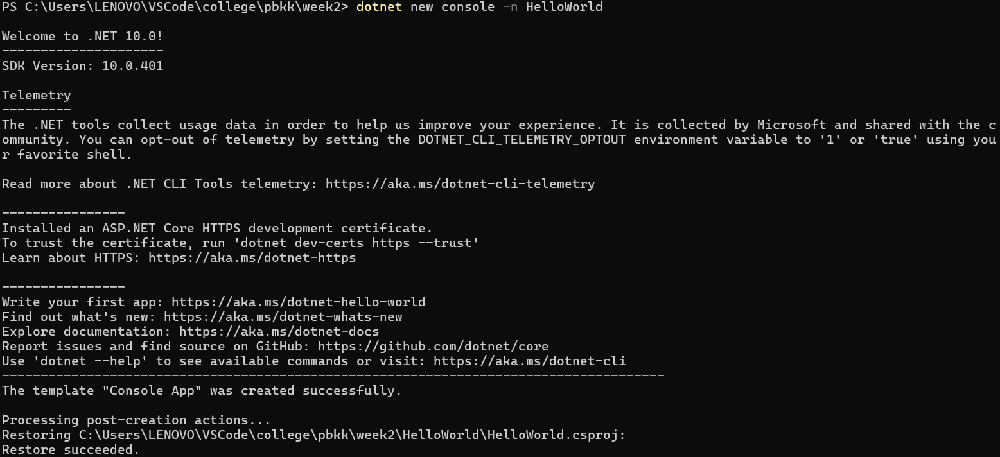
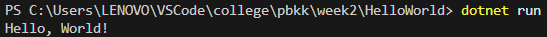

# HelloWorld

Aplikasi konsol C# sederhana yang dibuat menggunakan **.NET 10.0** untuk menampilkan teks `"Hello, World!"` ke terminal/konsol. Proyek ini berfungsi sebagai program pembuka dan uji coba lingkungan kerja (development environment) .NET CLI.

---

## Penjelasan Program

Program ini adalah aplikasi konsol standar berbasis .NET yang menggunakan fitur *Top-Level Statements* dari C#.

- **File Utama**: `Program.cs`
- **Kode**:
  ```csharp
  Console.WriteLine("Hello, World!");
  ```
- **Fungsi**: Memanggil method `Console.WriteLine` bawaan .NET runtime untuk mencetak satu baris teks ke standard output terminal, kemudian mengakhiri eksekusi program.
- **Konfigurasi Proyek (`HelloWorld.csproj`)**: Menentukan tipe output berupa `Exe` dengan target framework `.NET 10.0` (`net10.0`).

---

## Prasyarat Sistem

Sebelum menjalankan program, pastikan sistem Anda telah terpasang:
- [.NET SDK](https://dotnet.microsoft.com/download) (versi 10.0 atau yang kompatibel)
- Terminal / PowerShell / Command Prompt
- Kode editor seperti [Visual Studio Code](https://code.visualstudio.com/) atau Visual Studio

Untuk memverifikasi instalasi .NET, jalankan:
```bash
dotnet --version
```

---

## Cara Menjalankan dari Awal

### 1. Inisialisasi Proyek (Langkah Awal Pembuatan)
Jika Anda ingin membuat proyek ini dari nol menggunakan .NET CLI:
```bash
dotnet new console -n HelloWorld
```
Perintah ini akan men-generate struktur dasar aplikasi konsol beserta file `.csproj` dan `Program.cs`.



---

### 2. Masuk ke Direktori Proyek
Buka terminal dan navigasikan ke dalam folder proyek `HelloWorld`:
```bash
cd HelloWorld
```

---

### 3. Build dan Jalankan Program
Jalankan perintah berikut untuk meng-compile dan mengeksekusi program secara langsung:
```bash
dotnet run
```

Program akan menampilkan output:
```text
Hello, World!
```



---

## Struktur Direktori

```text
HelloWorld/
├── images/
│   ├── inisialisasi.png    # Tangkapan layar proses pembuatan proyek dengan CLI
│   └── hasil.png           # Tangkapan layar hasil eksekusi program
├── HelloWorld.csproj       # File konfigurasi proyek .NET
├── Program.cs              # Titik masuk utama program (source code)
└── README.md               # Dokumentasi proyek
```
