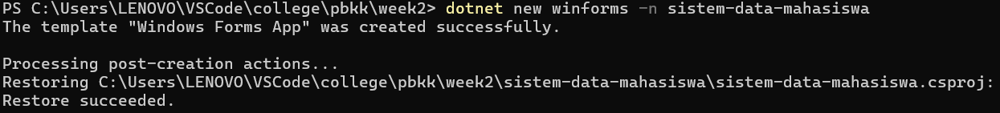
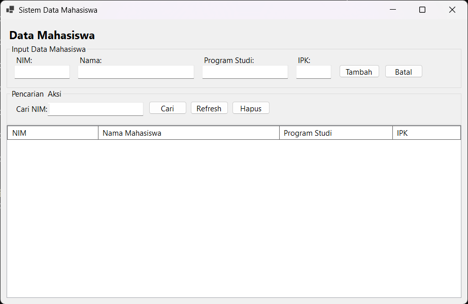
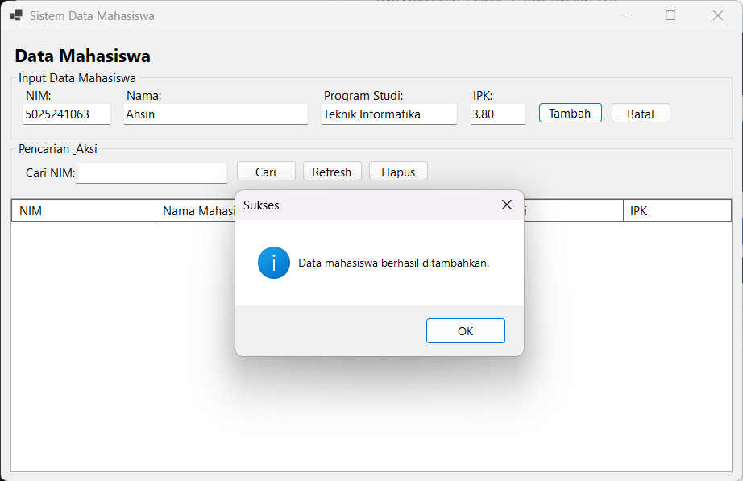
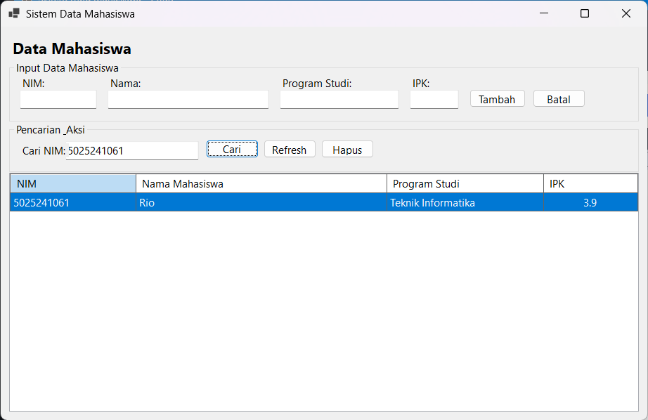
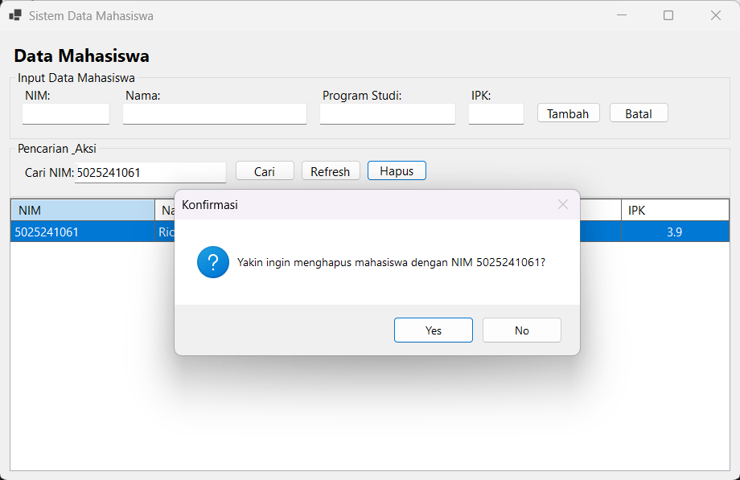
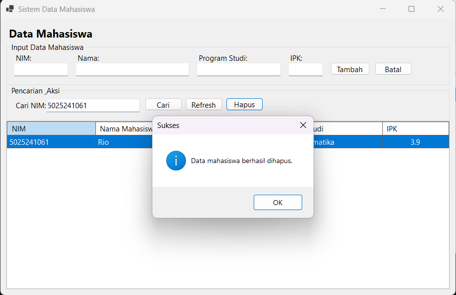

# Sistem Data Mahasiswa

Aplikasi desktop GUI sederhana berbasis **Windows Forms (.NET 10.0)** yang mengimplementasikan operasi **CRUD** (*Create, Read, Update, Delete*) dan pencarian data mahasiswa dengan penyimpanan lokal menggunakan **SQLite**.

---

## Penjelasan Program

Aplikasi ini dirancang untuk mengelola data akademik mahasiswa secara terstruktur, interaktif, dan persisten. Seluruh data disimpan ke dalam database file lokal `mahasiswa.db` sehingga data tetap tersimpan meskipun aplikasi ditutup.

### Arsitektur dan Komponen Utama

Program dibagi menjadi beberapa lapisan tanggung jawab (*separation of concerns*):

1. **Model (`Mahasiswa.cs`)**  
   Mendefinisikan entitas data mahasiswa yang mencakup properti:
   - `NIM` (*string*): Nomor Induk Mahasiswa (kunci utama/unik).
   - `Nama` (*string*): Nama lengkap mahasiswa.
   - `Prodi` (*string*): Program studi mahasiswa.
   - `IPK` (*double*): Indeks Prestasi Kumulatif (skala 0.00 – 4.00).

2. **Akses Data / Database Layer (`DatabaseHelper.cs`)**  
   Menangani koneksi SQLite dan eksekusi query SQL dengan *parameterized queries* (mencegah *SQL Injection*):
   - `Inisialisasi()`: Memastikan tabel `mahasiswa` tersedia di file `mahasiswa.db` secara otomatis saat aplikasi dimulai.
   - `AmbilSemua()`: Mengambil seluruh record mahasiswa terurut berdasarkan nama.
   - `Tambah(Mahasiswa)`: Menyimpan data mahasiswa baru ke tabel database.
   - `Cari(string nim)`: Mencari data mahasiswa berdasarkan NIM spesifik secara *case-insensitive* (`COLLATE NOCASE`).
   - `Hapus(string nim)`: Menghapus data mahasiswa dari database berdasarkan NIM.

3. **Antarmuka Pengguna / User Interface (`FormUtama.cs`)**  
   Menyediakan antarmuka grafis (GUI) responsif berbasis Windows Forms yang terdiri dari:
   - **Panel Input Data Mahasiswa**: Textbox untuk pengisian NIM, Nama, Prodi, dan IPK lengkap dengan validasi form (semua field wajib diisi dan nilai IPK harus valid antara 0 - 4), serta tombol **Tambah** dan **Batal** untuk mereset input.
   - **Panel Pencarian & Aksi**: Fitur pencarian mahasiswa berdasarkan NIM dengan tombol **Cari**, tombol **Refresh** untuk mereset filter dan memuat ulang seluruh data, serta tombol **Hapus** untuk menghapus mahasiswa terpilih.
   - **Tabel Data (DataGridView)**: Menampilkan data mahasiswa secara rapi dalam tabel. Mengetuk/mengklik baris pada tabel akan secara otomatis menyalin NIM ke kolom pencarian untuk mempermudah proses hapus atau pelacakan.
   - **Dialog Konfirmasi & Notifikasi**: Pop-up dialog interaktif untuk konfirmasi penghapusan data serta pesan feedback (sukses/peringatan/error).

4. **Titik Masuk (`Program.cs`)**  
   Menginisialisasi konfigurasi runtime Windows Forms (`ApplicationConfiguration.Initialize()`) dan menjalankan form utama `FormUtama`.

---

## Prasyarat Sistem

- **Sistem Operasi**: Windows 10 / Windows 11 (Windows Forms secara native dirancang untuk OS Windows).
- **.NET SDK**: Versi 10.0 (atau yang kompatibel dengan target `net10.0-windows`).
- **Package Dependency**: `Microsoft.Data.Sqlite` (versi 10.0.12).
- **Editor / IDE**: Visual Studio Code, Visual Studio 2022/terbaru, atau JetBrains Rider.

Verifikasi instalasi .NET SDK di terminal:
```bash
dotnet --version
```

---

## Cara Menjalankan dari Awal

### 1. Inisialisasi Proyek (Langkah Pembuatan Awal)
Jika Anda membangun proyek ini dari awal menggunakan .NET CLI:
```bash
dotnet new winforms -n sistem-data-mahasiswa
```
*Perintah ini membuat template awal proyek Windows Forms.*



---

### 2. Masuk ke Direktori Proyek
```bash
cd sistem-data-mahasiswa
```

---

### 3. Instalasi Paket SQLite
Tambahkan dependensi library SQLite ke dalam proyek:
```bash
dotnet add package Microsoft.Data.Sqlite --version 10.0.12
```

---

### 4. Menjalankan Aplikasi
Eksekusi perintah berikut pada terminal untuk me-restore dependensi, meng-compile, dan menjalankan aplikasi desktop:
```bash
dotnet run
```

---

## Panduan Penggunaan dan Tangkapan Layar

Berikut adalah alur penggunaan aplikasi beserta dokumentasi tangkapan layar yang tersedia:

### 1. Tampilan Utama Saat Pertama Dibuka
Ketika aplikasi pertama kali dijalankan, sistem secara otomatis menginisialisasi database `mahasiswa.db` dan menampilkan antarmuka utama yang siap menerima data.



---

### 2. Menambahkan Data Mahasiswa Baru
1. Isi kolom **NIM**, **Nama**, **Program Studi**, dan **IPK** pada panel input.
2. Klik tombol **Tambah**.
3. Sistem akan memvalidasi data dan memunculkan pop-up pemberitahuan bahwa data berhasil ditambahkan, kemudian tabel data akan diperbarui secara otomatis.



---

### 3. Mencari Mahasiswa Berdasarkan NIM
1. Masukkan NIM yang ingin dicari ke dalam kolom **Cari NIM**.
2. Klik tombol **Cari**.
3. Tabel akan menyaring dan menampilkan data mahasiswa yang sesuai dengan NIM tersebut.
4. Klik tombol **Refresh** untuk mengembalikan tampilan seluruh daftar mahasiswa.



---

### 4. Konfirmasi Penghapusan Data
1. Pilih baris data yang ingin dihapus pada tabel (NIM otomatis terisi di kolom pencarian) atau ketik langsung NIM pada kolom **Cari NIM**.
2. Klik tombol **Hapus**.
3. Sistem akan menampilkan dialog konfirmasi keamanan untuk memastikan apakah data benar-benar ingin dihapus.



---

### 5. Penghapusan Data Berhasil
Jika tombol **Yes** dipilih pada dialog konfirmasi, data akan dihapus dari database SQLite dan sistem menampilkan notifikasi sukses. Tabel data kemudian di-refresh secara otomatis.



---

## Struktur Direktori Proyek

```text
sistem-data-mahasiswa/
├── images/
│   ├── inisialisasi.png        # Tangkapan layar inisialisasi proyek CLI
│   ├── awal.png                # Tangkapan layar antarmuka awal
│   ├── tambah.png              # Tangkapan layar tambah data & notifikasi
│   ├── cari.png                # Tangkapan layar pencarian data berdasarkan NIM
│   ├── konfirmasi-hapus.png    # Tangkapan layar dialog konfirmasi hapus
│   └── hapus-berhasil.png      # Tangkapan layar notifikasi berhasil menghapus
├── DatabaseHelper.cs           # Modul koneksi & operasi CRUD database SQLite
├── FormUtama.cs                # Antarmuka pengguna (UI) & logika interaksi form
├── Mahasiswa.cs                # Model data class Mahasiswa
├── Program.cs                  # Entry point aplikasi Windows Forms
├── mahasiswa.db                # File database lokal SQLite (terbuat otomatis)
├── sistem-data-mahasiswa.csproj# Konfigurasi proyek .NET & dependencies
└── README.md                   # Dokumentasi proyek
```
