# CalculatorApp

Aplikasi desktop GUI sederhana berbasis **Windows Forms (.NET 8.0)** yang mengimplementasikan fungsi kalkulator aritmatika standar dengan antarmuka interaktif, penanganan ekspresi matematika, serta validasi kesalahan (*exception handling*).

---

## Penjelasan Program

Aplikasi ini dirancang untuk memproses kalkulasi matematika dasar secara intuitif melalui antarmuka grafis desktop. Nilai angka dan ekspresi matematika ditampilkan secara langsung pada layar kalkulator (`txtDisplay`), dan komputasi dieksekusi saat pengguna menekan tombol sama dengan (`=`) atau menekan tombol operator berikutnya secara berantai (*chaining operations*).

### Arsitektur dan Komponen Utama

Program dibagi menjadi beberapa lapisan komponen dan tanggung jawab:

1. **Antarmuka Pengguna / User Interface (`Form1.Designer.cs`)**  
   Menyediakan tata letak antarmuka kalkulator menggunakan grid 4 kolom:
   - **Label (`lblTitle`)**: Menampilkan judul aplikasi kalkulator pada bagian atas form.
   - **Layar Display (`txtDisplay`)**: TextBox satu baris dengan perataan teks rata kanan (*Right-aligned*) untuk menampilkan input angka, ekspresi operasi, dan hasil perhitungan.
   - **Tombol Angka (0–9)**: Tombol input angka yang terhubung ke satu event handler terpusat `NumberButton_Click`.
   - **Tombol Operator (`+`, `−`, `×`, `÷`)**: Tombol pemilihan operasi matematika yang dikelola oleh `OperatorButton_Click`.
   - **Tombol Kontrol (`.`, `C`, `=`)**: Tombol desimal (`btnDecimal`), tombol pembersih/reset (`btnClear`), dan tombol eksekusi hasil (`btnEquals`).

2. **Logika Bisnis dan Event Handler (`Form1.cs`)**  
   Menangani seluruh alur kalkulasi dan interaksi pengguna:
   - `NumberButton_Click`: Menangani pengetikan angka 0 sampai 9 secara dinamis dengan membaca properti `Text` dari tombol yang diklik melalui parameter `sender`.
   - `OperatorButton_Click`: Menyimpan operan pertama, mencatat jenis operator matematika yang dipilih, serta secara otomatis menghitung kalkulasi sebelumnya jika operator ditekan beruntun.
   - `CalculateResult`: Mengurai teks ekspresi, memvalidasi pembagian dengan angka nol, mengeksekusi operasi aritmatika melalui percabangan `switch-case`, dan memperbarui layar display.
   - `btnClear_Click`: Mengembalikan seluruh variabel status kalkulator (`firstNumber`, `secondNumber`, `result`, `operation`) ke nilai awal dan menampilkan angka `0` pada layar display.
   - `btnDecimal_Click`: Memastikan titik desimal hanya dapat ditambahkan satu kali per operan bilangan.

3. **Titik Masuk Aplikasi (`Program.cs`)**  
   Menginisialisasi konfigurasi runtime Windows Forms (`ApplicationConfiguration.Initialize()`) dan menjalankan form utama `Form1`.

---

## Prasyarat Sistem

Sebelum menjalankan program, pastikan sistem Anda telah terpasang:
- **Sistem Operasi**: Windows 10 / Windows 11 (Windows Forms secara native dirancang untuk OS Windows).
- **.NET SDK**: Versi 8.0 (atau yang kompatibel dengan target `net8.0-windows`).
- **Editor / IDE**: Visual Studio 2022 (dengan workload *.NET Desktop Development*), Visual Studio Code (dengan ekstensi *C# Dev Kit*), atau JetBrains Rider.

Verifikasi instalasi .NET SDK di terminal:
```bash
dotnet --version
```

---

## Cara Menjalankan dari Awal

### 1. Inisialisasi Proyek (Langkah Pembuatan Awal)
Jika Anda membangun proyek ini dari nol menggunakan .NET CLI:
```bash
dotnet new winforms -n CalculatorApp
```
*Perintah ini membuat template awal proyek Windows Forms dengan C#.*

---

### 2. Masuk ke Direktori Proyek
Buka terminal dan navigasikan ke dalam folder proyek `CalculatorApp`:
```bash
cd CalculatorApp
```

---

### 3. Build Proyek
Jalankan perintah berikut untuk meng-compile kode sumber dan memverifikasi dependensi proyek:
```bash
dotnet build
```

---

### 4. Menjalankan Aplikasi
Eksekusi perintah berikut pada terminal untuk menjalankan aplikasi desktop:
```bash
dotnet run
```
Jendela aplikasi kalkulator desktop akan muncul dan siap digunakan.

---

## Panduan Penggunaan dan Tangkapan Layar

Berikut adalah alur penggunaan aplikasi beserta dokumentasi tangkapan layar hasil pengujian fitur:

### 1. Tampilan Utama Saat Pertama Dibuka
Ketika aplikasi pertama kali dijalankan, layar kalkulator menampilkan nilai awal `0` dengan susunan tombol angka dan operator yang siap menerima input.

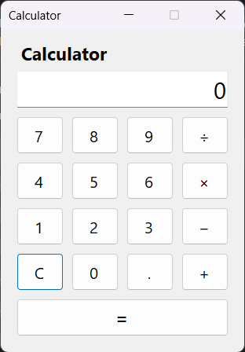

---

### 2. Operasi Penjumlahan (10 + 20 = 30)
1. Masukkan angka `10`, lalu tekan tombol operator `+`.
2. Masukkan angka kedua `20`. Layar menampilkan ekspresi operasi `10 + 20`.

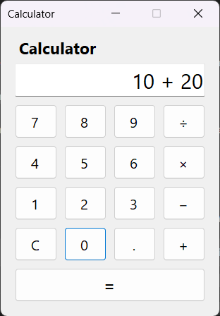

3. Tekan tombol sama dengan (`=`). Sistem menjumlahkan kedua angka dan menampilkan hasil `30`.

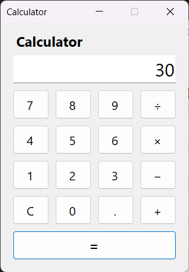

---

### 3. Operasi Pengurangan (30 − 12 = 18)
1. Masukkan angka `30`, lalu tekan tombol operator `−`.
2. Masukkan angka kedua `12`. Layar menampilkan ekspresi operasi `30 − 12`.

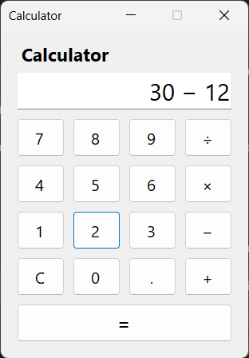

3. Tekan tombol sama dengan (`=`). Sistem mengurangkan angka kedua dan menampilkan hasil `18`.

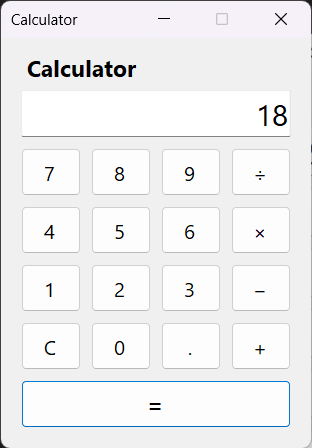

---

### 4. Operasi Perkalian (6 × 7 = 42)
1. Masukkan angka `6`, lalu tekan tombol operator `×`.
2. Masukkan angka kedua `7`. Layar menampilkan ekspresi operasi `6 × 7`.

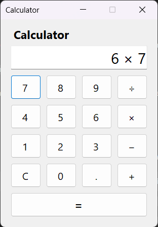

3. Tekan tombol sama dengan (`=`). Sistem mengalikan kedua angka dan menampilkan hasil `42`.

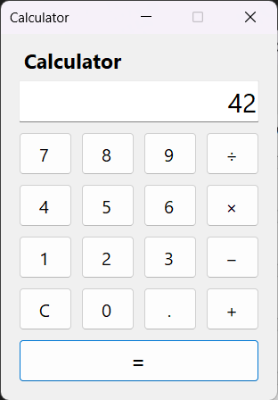

---

### 5. Operasi Pembagian (100 ÷ 4 = 25)
1. Masukkan angka `100`, lalu tekan tombol operator `÷`.
2. Masukkan angka kedua `4`. Layar menampilkan ekspresi operasi `100 ÷ 4`.

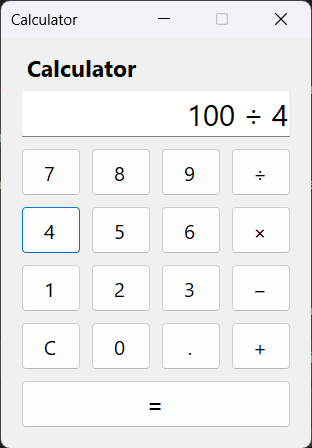

3. Tekan tombol sama dengan (`=`). Sistem membagi operan pertama dengan operan kedua dan menampilkan hasil `25`.

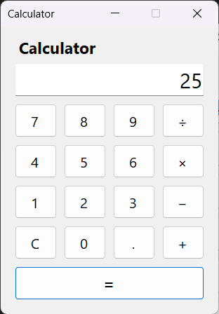

---

### 6. Operasi Bilangan Desimal (2.5 × 4 = 10)
1. Masukkan angka `2`, tekan tombol titik desimal `.`, lalu masukkan angka `5`.
2. Tekan tombol operator `×`, kemudian masukkan angka `4`. Layar menampilkan ekspresi `2.5 × 4`.

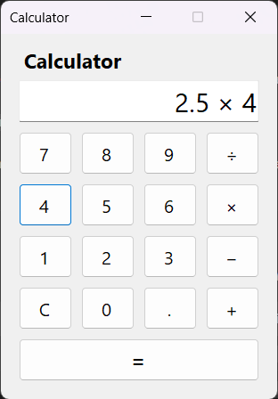

3. Tekan tombol sama dengan (`=`). Sistem memproses bilangan berkoma dan menampilkan hasil `10`.

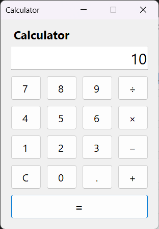

---

### 7. Penanganan Kesalahan: Pembagian dengan Nol (30 ÷ 0)
Ketika pengguna mencoba membagi suatu bilangan dengan angka nol (`30 ÷ 0`), sistem memvalidasi bahwa angka pembagi bernilai `0` dan melempar `DivideByZeroException`. Eksepsi ditangkap oleh blok `catch` dan menampilkan pesan dialog error secara aman tanpa menghentikan aplikasi secara paksa (*crash*).

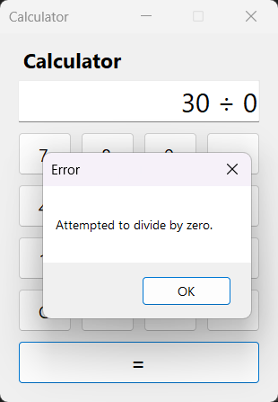

---

## Struktur Direktori Proyek

```text
CalculatorApp/
├── images/
│   ├── tampilan-awal.png       # Tangkapan layar antarmuka awal kalkulator
│   ├── tambah-1.png            # Tangkapan layar input operasi penjumlahan
│   ├── tambah-2.png            # Tangkapan layar hasil operasi penjumlahan
│   ├── kurang-1.png            # Tangkapan layar input operasi pengurangan
│   ├── kurang-2.png            # Tangkapan layar hasil operasi pengurangan
│   ├── kali-1.png              # Tangkapan layar input operasi perkalian
│   ├── kali-2.png              # Tangkapan layar hasil operasi perkalian
│   ├── bagi-1.png              # Tangkapan layar input operasi pembagian
│   ├── bagi-2.png              # Tangkapan layar hasil operasi pembagian
│   ├── desimal-1.png           # Tangkapan layar input operasi desimal
│   ├── desimal-2.png           # Tangkapan layar hasil operasi desimal
│   └── error-0.png             # Tangkapan layar pesan error pembagian nol
├── CalculatorApp.csproj        # File konfigurasi proyek .NET & dependencies
├── Form1.cs                    # Logika event handler dan perhitungan kalkulator
├── Form1.Designer.cs           # Deklarasi komponen dan tata letak kontrol antarmuka
├── Form1.resx                  # File resource form
├── Program.cs                  # Titik masuk utama aplikasi (entry point)
└── README.md                   # Dokumentasi proyek
```

---

## Refleksi Mahasiswa

### 1. Apa fungsi object sender pada event handler?
Pada paradigma pemrograman berbasis event (*event-driven programming*) di C#/.NET, parameter `object sender` berfungsi sebagai **referensi ke objek atau kontrol UI yang memicu (menembakkan) event tersebut**.

Sebagai contoh, ketika pengguna mengklik salah satu tombol angka, event handler `NumberButton_Click(object sender, EventArgs e)` dipanggil. Parameter `sender` berisi tombol fisik (`Button`) yang sedang diklik. Dengan melakukan *type casting*:
```csharp
Button button = (Button)sender;
```
Program dapat membaca properti dari kontrol tersebut, seperti `button.Text` (angka yang tertera pada tombol) atau `button.Name`. Hal ini memungkinkan satu method event handler digunakan bersama-sama oleh banyak kontrol secara dinamis tanpa perlu menuliskan method terpisah untuk setiap tombol.

---

### 2. Mengapa semua tombol angka dapat memakai satu NumberButton_Click?
Karena seluruh tombol angka (`0` sampai `9`) memiliki **perilaku dan alur logika pemrosesan yang identik**, yaitu:
1. Membaca teks atau angka dari tombol yang sedang diklik.
2. Memeriksa apakah tampilan saat ini bernilai `"0"` atau baru saja menampilkan hasil kalkulasi sebelumnya.
3. Menimpa atau menyambungkan karakter angka tersebut ke dalam display (`txtDisplay.Text`).

Dengan memanfaatkan `object sender` yang di-cast ke tipe `Button`, event handler `NumberButton_Click` dapat langsung mengambil nilai `button.Text`. Pendekatan ini menerapkan prinsip **DRY (*Don't Repeat Yourself*)**, mencegah duplikasi kode untuk kesepuluh tombol angka, dan membuat kode program menjadi jauh lebih ringkas, bersih, dan mudah dirawat (*maintainable*).

---

### 3. Apa perbedaan firstNumber, secondNumber, dan result?
Ketiga variabel tersebut bertipe data `double` dan memiliki peranan spesifik dalam siklus perhitungan aritmatika:
1. **`firstNumber` (Operan Pertama)**: Berfungsi untuk menyimpan nilai numerik pertama yang dimasukkan pengguna sebelum tombol operator aritmatika (`+`, `−`, `×`, `÷`) ditekan.
2. **`secondNumber` (Operan Kedua)**: Berfungsi untuk menyimpan nilai numerik kedua yang dimasukkan pengguna setelah operator dipilih, tepat sebelum proses perhitungan dieksekusi (saat tombol sama dengan `=` ditekan).
3. **`result` (Hasil Perhitungan)**: Berfungsi untuk menampung nilai akhir dari hasil evaluasi operasi matematika antara `firstNumber` dan `secondNumber` sesuai dengan operator yang aktif. Nilai ini kemudian dikonversi menjadi string dan ditampilkan kembali pada layar kalkulator.

---

### 4. Mengapa pembagian dengan nol perlu divalidasi?
Pembagian dengan nol perlu divalidasi karena alasan-alasan berikut:
1. **Aturan Matematika Dasar**: Secara matematis, pembagian suatu bilangan dengan angka nol adalah operasi yang tidak terdefinisi (*undefined*).
2. **Perilaku Tipe Data di .NET**: Pada tipe data integer, pembagian dengan nol akan langsung memicu error runtime `DivideByZeroException`. Namun pada tipe bilangan berkoma (`double`), operasi pembagian dengan nol di C# secara default menghasilkan nilai `Infinity` atau `NaN` (*Not a Number*), bukan exception langsung.
3. **Integritas Aplikasi dan Pengalaman Pengguna (UX)**: Jika tidak divalidasi, kalkulator akan menampilkan teks `∞` / `Infinity` yang tidak informatif bagi pengguna dan dapat merusak kalkulasi lanjutan. Dengan melakukan validasi eksplisit:
   ```csharp
   if (secondNumber == 0)
       throw new DivideByZeroException();
   ```
   Aplikasi dapat mendeteksi kondisi ilegal tersebut, menghentikan eksekusi operasi, dan memberikan umpan balik berupa pesan error yang jelas dan mudah dipahami.

---

### 5. Bagaimana try-catch membantu menjaga aplikasi tetap stabil?
Blok `try-catch` (*structured exception handling*) menjaga kestabilan aplikasi dengan cara:
1. **Mencegah Aplikasi Keluar Paksa (*Crash*)**: Baris kode yang berpotensi menghasilkan kesalahan runtime—seperti kegagalan parsing format angka (`double.Parse`) atau pembagian dengan nol—ditempatkan di dalam blok `try`. Jika terjadi kegagalan, runtime .NET tidak akan langsung mematikan proses aplikasi (*unhandled exception*), melainkan mengalihkan alur eksekusi ke blok `catch`.
2. **Penanganan Error Terkendali**: Pada blok `catch`:
   ```csharp
   catch (Exception ex)
   {
       MessageBox.Show(ex.Message, "Error");
   }
   ```
   Aplikasi menangkap pesan kesalahan dan menampilkannya kepada pengguna melalui dialog pesan peringatan secara terstruktur.
3. **Menjaga Aplikasi Tetap Berjalan**: Setelah dialog error ditutup oleh pengguna, antarmuka aplikasi tetap aktif, responsif, dan siap menerima input baru tanpa kehilangan state atau merusak form.
